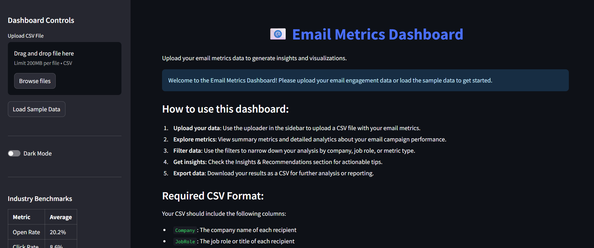

# Email_Stats



## 📧 Overview

The Email Metrics Dashboard is a powerful Streamlit application designed to analyze and visualize email campaign performance data. This interactive dashboard helps marketers and business professionals gain insights into email engagement metrics such as open rates, click rates, and overall engagement across different companies and job roles.

## 🚀 Features

- **Comprehensive Metrics**: Track open rates, click rates, click-to-open rates (CTOR), and custom engagement scores
- **Interactive Filtering**: Filter data by company, job role, and metric type
- **Visual Analytics**: View performance through dynamic bar charts and correlation analyses
- **Detailed Breakdowns**: See engagement metrics by company and job role
- **Simulation Tools**: Project future campaign performance based on current metrics
- **Data Export**: Export your analysis as CSV for further processing
- **Industry Benchmarks**: Compare your performance against industry standards
- **Personalized Insights**: Get actionable recommendations based on your data

## 📋 Requirements

- Python 3.7 or higher
- Streamlit
- Pandas
- NumPy
- Plotly

## 🔧 Installation

1. Clone the repository:
   ```bash
   git clone https://github.com/NullIsMySoul/Email_Stats.git
   cd Email_Stats
   ```

2. Install the required packages:
   ```bash
   pip install -r requirements.txt
   ```

3. Run the Streamlit app:
   ```bash
   streamlit run streamlit_app.py
   ```

## 📊 How to Use

### 1. Preparing Your Data

Your CSV file should include the following columns:

| Column Name | Description | Example Values |
|-------------|-------------|---------------|
| Company | Name of the recipient's company | "Acme Corp", "TechGiant" |
| JobRole | Job title or role of the recipient | "CEO", "Marketing Director" |
| PersonName | Name of the recipient | "John Smith", "Jane Doe" |
| EmailsSent | Whether an email was sent | "yes", "no", 1, 0 |
| EmailsOpened | Whether the email was opened | "yes", "no", 1, 0 |
| EmailsClicked | Whether the email was clicked | "yes", "no", 1, 0 |

### 2. Loading Data

- **Upload CSV**: Click the "Browse files" button in the sidebar to upload your CSV data
- **Sample Data**: Alternatively, click "Load Sample Data" to explore the dashboard with demo data

### 3. Using the Dashboard

- **Filters**: Use the dropdown menus at the top to filter by company, job role, or metric type
- **Summary Metrics**: View key performance indicators at the top of the dashboard
- **Performance Analysis**: Toggle between bar charts and data tables to analyze your data
- **Insights & Recommendations**: Expand this section to see personalized insights based on your data
- **Advanced Analytics**: Explore correlation patterns and run future campaign simulations
- **Data Export**: Download your filtered data as a CSV file for further analysis

## 🔍 Understanding the Metrics

- **Open Rate**: Percentage of sent emails that were opened
- **Click Rate**: Percentage of sent emails that had at least one click
- **Click-to-Open Rate (CTOR)**: Percentage of opened emails that were clicked
- **Engagement Score**: A weighted metric combining open rate (40%) and click rate (60%)

## 💻 For Developers

### Project Structure

The application is contained in a single Python file with the following components:

- **Page Configuration**: Sets up the Streamlit interface
- **Custom CSS**: Provides styling for the dashboard elements
- **Helper Functions**: Process data and calculate metrics
- **Data Loading**: Handles CSV upload and sample data creation
- **Data Processing**: Converts and calculates metrics from raw data
- **Visualization Components**: Creates charts and interactive elements
- **Insights Generation**: Produces recommendations based on the data
- **Advanced Analytics**: Creates correlation charts and simulations

### Key Functions

- `convert_binary_data(df)`: Converts yes/no values to 1/0 for metrics columns
- `calculate_metrics(df)`: Calculates open rates, click rates, and engagement scores
- `generate_industry_benchmarks()`: Provides comparison benchmarks
- `create_sample_data()`: Generates demo data for the dashboard

### Customization Options

#### Adding New Metrics

To add a new metric, modify the `calculate_metrics()` function:

```python
def calculate_metrics(df):
    # Existing code...
    
    # Add your new metric calculation
    result_df['NewMetric'] = np.where(condition,
                                     calculation_if_true,
                                     calculation_if_false)
    
    return result_df
```

#### Modifying the UI

The dashboard uses Streamlit components and custom CSS. To modify the UI:

1. Update the CSS in the `st.markdown("""<style>...""")` section
2. Modify the layout using Streamlit's column system: `col1, col2 = st.columns(2)`
3. Add new visualization sections using tabs: `tab1, tab2 = st.tabs(["Tab1", "Tab2"])`

#### Adding New Visualizations

To add a new chart:

```python
# Create a new figure
fig = go.Figure(go.Bar(
    x=data['x_values'],
    y=data['y_values'],
    text=[f"{val:.1f}%" for val in data['y_values']],
    textposition='outside',
    marker_color='rgba(74, 111, 255, 0.7)'
))

# Configure layout
fig.update_layout(
    title='Chart Title',
    xaxis_title='X-Axis Label',
    yaxis_title='Y-Axis Label',
    height=400
)

# Display the chart
st.plotly_chart(fig, use_container_width=True)
```

## 🛠️ Troubleshooting

### Common Issues

- **CSV Format Errors**: Ensure your CSV has all required columns with correct names
- **Data Type Errors**: The application will try to convert text values like "yes"/"no" to binary, but consistent formatting is recommended
- **Empty Charts**: Check if your filters have removed all relevant data points
- **Performance Issues**: For very large datasets, consider pre-aggregating your data

### Support

For issues or feature requests, please open an issue on the GitHub repository or contact the development team.

## 🙏 Acknowledgments

- Built with [Streamlit](https://streamlit.io/)
- Data visualizations powered by [Plotly](https://plotly.com/)
- Data processing with [Pandas](https://pandas.pydata.org/) and [NumPy](https://numpy.org/)
